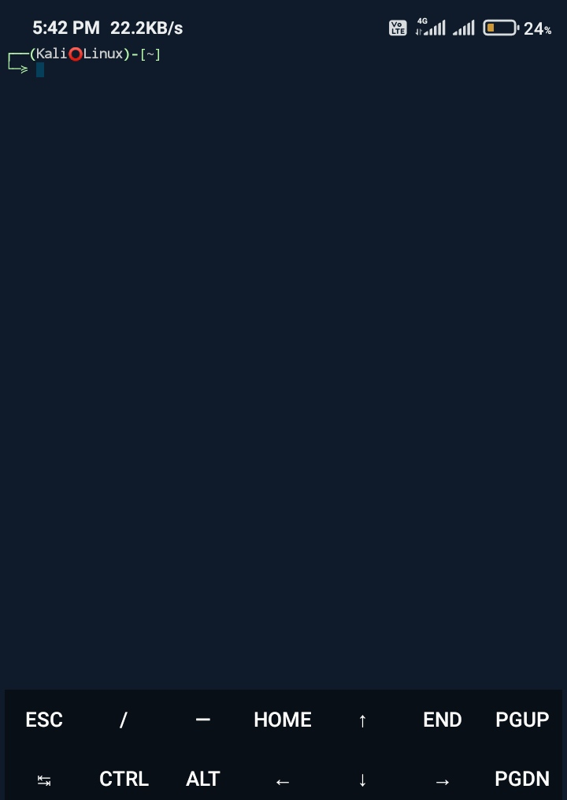

# Terminal-In-Termux
Kali-LInux-Terminal-In-Termux
<div align="center">
  
  <p align="center">
Change termux terminal look like Kali LInux or better. No external git required, you just need one liner commands you will get here. Must watch full video to set it up.

```
pkg upgrade -y
wget https://raw.githubusercontent.com/alvinbaby/Terminal-In-Termux/main/Terminal.sh
bash colors.properties.sh
```

Hopw to copy the color properties as shown in the video?
Use the commands
<pre> cd $HOME </pre>
<pre> cd .termux</pre>
# note: color7 is the text color for termux input
<pre> cp colors.properties ../;rm colors.properties</pre>
<pre> wget https://raw.githubusercontent.com/alvinbaby/Terminal-In-Termux/main/alvinbaby/colors.properties </pre>

Hopw to change termux terminal should look like Kali Linux Terminal?
Paste the command in the location <b>/data/data/com.termux/files/usr/etc/bash.bashrc</b> the commands... Where to paste? for that you need to watch the video.

<h2>Script to add Kali LInux Terminal in Termux</h2>
<b>nano /data/data/com.termux/files/usr/etc/bash.bashrc</b>
<pre>
EMOJIS=(🥱 😏 😎 👊  👍 💀️ 😉️ 🤔️ 🙄️ 😣️ 😳️ 💥 🔥 😵‍ 💫 ㉿)
RANDOM_EMOJI() {
  SELECTED_EMOJI=${EMOJIS[$RANDOM % ${#EMOJIS[@]}]};
  echo $SELECTED_EMOJI;
} </pre></pre>


#Place any one at the end of the file
#Normal Withour imoji
<pre>PS1='\[\e[1;34m\]\[\e[92m\]┌──(\[\e[37m\]TERMAX⭕LINUX\[\e[92m\])-\[\e[0m\]\[\e[92m\][\e[0m\]\[\e[37m\]\w\[\e[0m\]\[\e[92m\]]\[\e[0m\]\[\[\e[0m\]\n\[\e[92m\]└─≽ \[\e[0m\]'
</pre>

<pre>#With imoji animation
 PS1='\[\e[1;34m\]\e[92m\]┌──(\e[37m\]MR$(RANDOM_EMOJI)JINN\e[92m\])-\e[0m\]\e[92m\][\e[0m\]\e[37m\]~\e[0m\]\e[92m\]]\e[0m\]\e[0m\]\e[92m\]\n└─≽ '
</pre>

You can replace -w with as per your need:
<pre>Time12h="\T"
Time12a="\@"
PathShort="\w"
PathFull="\W"
NewLine="\n"
Jobs="\j"</pre>
